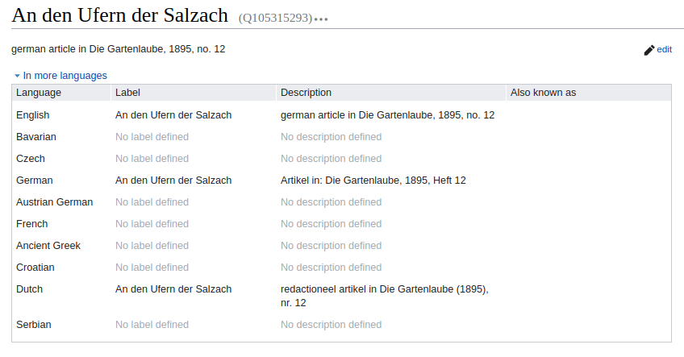
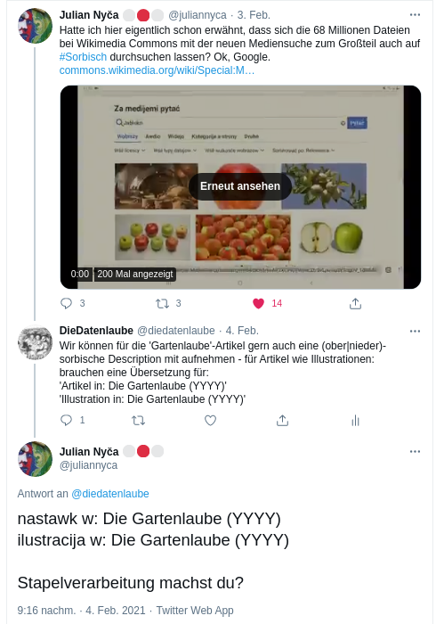
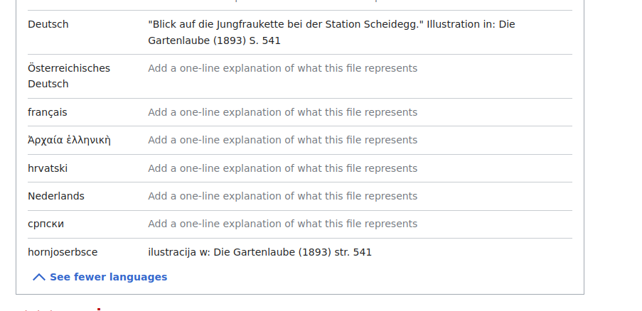
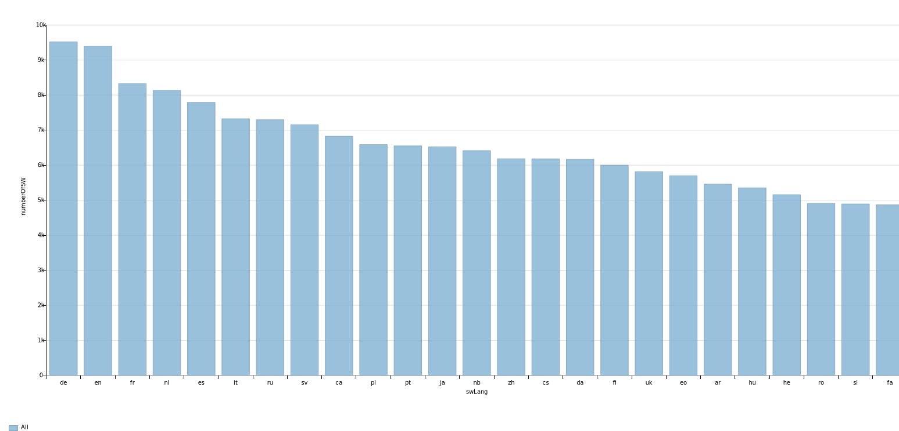

<h1 id="mehrsprachige-datenlaube">Die mehrsprachige Datenlaube – obersorbisch beispielsweise</h1>

Multilingualität ist eines der wesentlichen Merkmale von Wikidata. <a href="https://w.wiki/xuZ">Knapp 600 Sprachen oder Varianten</a> sind aktuell im offenen Knowledge Graph des Wiki*Versums verfügbar um die jeweiligen Datensätze mit einem Label, einer Beschriftung oder einem Variantennamen zu versehen, bzw. in spezifischen mehrsprachigen Datenfelder (bspw. die Felder ‚<a href="https://www.wikidata.org/wiki/Property:P1476">Titel</a>‘ oder das <a href="https://www.wikidata.org/wiki/Property:P6375">Adress-Textfeld</a>) Textwerte mit der zugrundeliegenden Sprache zu versehen. 

<h2 id="mehrsprachige-beschreibungen-für-katalogdaten-und-illustrationen">Mehrsprachige Beschreibungen für Katalogdaten und Illustrationen</h2>

Die Mehrsprachigkeit von Wikidata legt auch offen aus welchen Sprach- und Kulturkreis bestimmte Items stammen oder ihnen zuzurechnen sind. Die bibliographischen Items der Datenlaube wurden beispielsweise <a href="https://diedatenlaube.github.io/die_datenlaube_der_gartenlaube">bislang standardmäßig dreisprachig</a> mit Labels und Beschreibungstexten in Deutsch, Englisch und Niederländisch erfasst. (vgl. Abb. 1.)

<figure>
<figcaption>Abbildung 1: Labels und Descriptions von Gartenlaube-Items in deutsch, englisch, holländisch für den Gartelbaube-Artikel <a href="https://de.wikisource.org/wiki/An_den_Ufern_der_Salzach">'An den Ufern der Salzach'</a>,&nbsp;<a href="https://www.wikidata.org/wiki/Q105315293">(Q105315293)</a>.</figcaption>
</figure>

&nbsp;

Das Label von bibliographischen Items wird standardmäßig zumeist mit dem Originaltitel des vorliegenden Werkes versehen, weshalb es eher nicht zu einer Übersetzung des Titels in Zielsprachen kommt. Der Beschreibungstext hingegen erlaubt es in der jeweiligen Sprache anzuzeigen, was das vorliegende Item beschreiben möchte – beispielsweise einen (Zeitschriften)-Artikel (in deutscher Sprache) in der Zeitschrift ‚Die Gartenlaube‘ mit Publikationsjahr und Fundstelle (Heftnummer und/oder Seitenzahl). 

Gerade für das Beschreibungsfeld, das sich bei bibliographischen Datensätzen nach einem sehr stringenten Muster aufbaut, ist die Anreicherung mit weiteren Sprachen leicht möglich. Für die (nieder- und ober-)<a href="https://de.wikipedia.org/wiki/Sorbische_Sprache">sorbische Sprache</a> wurden Beschreibungstexte ergänzt. 

<figure>
<figcaption>Abbildung 2: Tweet als Anstoß Gartenlaube-Items in sorbischer Sprache zu beschreiben https://twitter.com/juliannyca/status/1357422861695213569</figcaption>
</figure>

&nbsp;

Auf Basis der in Abbildung 2 gezeigten Vorlage kann mittels <a href="https://w.wiki/xuw">SPARQL-Query </a>eine Grundlage für neue Beschreibungstexte in nieder- und obersorbischer Sprache abgefragt und zum Import mittels <a href="https://quickstatements.toolforge.org/">QuickStatements</a> verwendet werden. 

Die selbe Vorgehensweise gilt auch für die mehrsprachigen Beschreibungstexte der Gartenlaube-Illustrationen in Wikimedia Commons wie in Abbildung 3 gezeigt. 

<figure>
<figcaption>Abbildung 3: Mehrsprachige Dateibeschreibungen in Wikimedia Commons, hier im Bild: Metadaten für <a href="https://commons.wikimedia.org/wiki/File:Die_Gartenlaube_(1893)_b_541.jpg">"Blick auf die Jungfraukette bei der Station Scheidegg." Illustration in: Die Gartenlaube (1893) S. 541</a>.</figcaption>
</figure>
<h2 id="mehrsprachige-sacherschließung">Mehrsprachige Sacherschließung</h2>

Beschreibungstexte sind aber mehr eine Fingerübung und bieten gerade im vorliegenden Fall einen eher überschaubaren Mehrwert. Gänzlich anders verhält es sich, wenn man die mehrsprachige Verfügbarkeit von Item-Labels und Descriptions bei verlinkten Entitäten betrachtet. Gerade die für die inhaltliche Erschließung der Artikel verwendeten Schlagworte können, wenn sie denn übersetzt sind, ermöglichen auf Basis fremdsprachiger Einstiege nach inhaltlichen Bezügen in den (deutschsprachigen) Artikeln zu recherchieren. 

Um hier einen Beitrag zu leisten, kann nach Schlagworten in Gartenlaube-Artikel abgefragt werden, die in einer bestimmten Zielsprache noch kein Label besitzen, der folgende <a href="https://w.wiki/xv2">Code-Block </a>zeigt dies für die obersorbische Sprache, ausgenommen von den Schlagworten sind Personen-Items, da es hier bei den Labels abgesehen von kulturellen oder sprachlichen Erfordernissen nicht zu einer Übersetzung kommt. 

<pre>
SELECT DISTINCT ?schlagwort ?schlagwortLabel ?schlagwortLangLab WHERE {
  ?item wdt:P1433 wd:Q655617;
    wdt:P921 ?schlagwort.
  FILTER(NOT EXISTS {
    ?schlagwort rdfs:label ?schlagwortLangLab.
    FILTER((LANG(?schlagwortLangLab)) = "hsb") #Hier Sprachcode einbauen
  })
  MINUS { ?schlagwort wdt:P31 wd:Q5. }
  SERVICE wikibase:label { bd:serviceParam wikibase:language "[AUTO_LANGUAGE],en". }
}
</pre>

Datenpflege nach diesem Muster erlaubt es in Wikidata nach Artikeln der Gartenlaube zu <a href="https://w.wiki/xv7">recherchieren</a>, deren Thema „Kamjenc“ (obersorbisch für Kamenz) ist.

<pre>
SELECT ?item ?itemLabel ?schlagwortLangLab WITH { 
  SELECT DISTINCT ?item ?schlagwortLangLab WHERE {
  ?item wdt:P1433 wd:Q655617;
    wdt:P921 ?schlagwort.
  ?schlagwort rdfs:label ?schlagwortLangLab.
  FILTER((LANG(?schlagwortLangLab)) = "hsb")
 } } AS %results 
WHERE {
  INCLUDE %results.
  FILTER(CONTAINS(?schlagwortLangLab,"Kamjenc"))
  SERVICE wikibase:label { bd:serviceParam wikibase:language "[AUTO_LANGUAGE],hsb,en". }
}
</pre>

Wikidata bietet Mehrsprachigkeit, da potentiell jedes Datenobjekt multilinguale Aussagen enthalten kann. So können Wikimedia- und andere offene Datenportale unterschiedlicher Sprach- und Kulturkreise, mit überschaubarem Aufwand Datenbestände anreichern und abfragen, um sie multilingual erfahr- und nutzbar zu machen.

<h2 id="ein-blick-auf-die-mehrsprachigkeit">Ein Blick auf die Mehrsprachigkeit</h2>

Zum Zeitpunkt (2020-02-05) lagen für die zur Beschreibung der Gartenlaube-Artikel verwendeten Schlagworte Labels in 424 verschiedenen Sprachen vor. Wie viele Schlagworte je Sprache dabei vorhanden sind zeigt das folgende <a href='https://w.wiki/xzw'>Diagramm</a>:

<figure>
<figcaption>Abbildung 4: Verteilung der Labels der Gartenlaube-Schlagwörter nach den 25 häufigsten Sprachen. (<a href='https://w.wiki/xzv'>https://w.wiki/xzv</a>)</figcaption>
</figure>

Für 9.517 Schlagworte liegen deutsche Labels vor, gefolgt von 9.392 Items mit englischen Labels. Beispielsweise liegt hingegen mit tunesisch-arabischem Label am anderen Ende der Skala nur ein einziges Item vor. Knapp 1.500 Items verfügen über ein obersorbisches Label und 650 über ein niedersorbisches.

<iframe style="width: 80vw; height: 50vh; border: none;" src="https://query.wikidata.org/embed.html#SELECT%20%3FswLang%20(COUNT(DISTINCT%20%3Fschlagwort)%20AS%20%3FnumberOfSW)%20WHERE%20%7B%0A%20%20%3Fitem%20wdt%3AP1433%20wd%3AQ655617%3B%0A%20%20%20%20wdt%3AP921%20%3Fschlagwort.%0A%20%20%3Fschlagwort%20rdfs%3Alabel%20%3FswLabel.%0A%20%20BIND(LANG(%3FswLabel)%20AS%20%3FswLang)%0A%7D%0AGROUP%20BY%20%3FswLang%0AORDER%20BY%20DESC(%3FnumberOfSW)" referrerpolicy="origin" sandbox="allow-scripts allow-same-origin allow-popups"></iframe>

<h2 id="verbessert-die-mehrsprachigkeit">Verbessert die Mehrsprachigkeit!</h2>

Um abzufragen welche Schlagwortlabels der Gartenlaube noch nicht in eine bestimmte Sprache übersetzt sind, wählt man zuerst einen Sprachcode aus dieser <a href="https://w.wiki/xuZ">Abfrage</a> aus und setzt den Code in der Abfrage nach fehlenden <a href="https://w.wiki/xv2">Schlagwort-Labels</a> ein. Und schon kann Labels zum Beispiel „<a href="https://w.wiki/xvD">ins Boarische iwasetzn</a>“. 

&nbsp;

Christian Erlinger, 5. Februar 2021

&nbsp;&nbsp;&nbsp;<a rel="license" href="http://creativecommons.org/licenses/by/4.0/">Creative Commons Namensnennung 4.0 International Lizenz</a> <a rel="license" href="http://creativecommons.org/licenses/by/4.0/">

Item dieses Artikels: <a href="https://www.wikidata.org/wiki/Q105332598">(Q105332598)</a>

