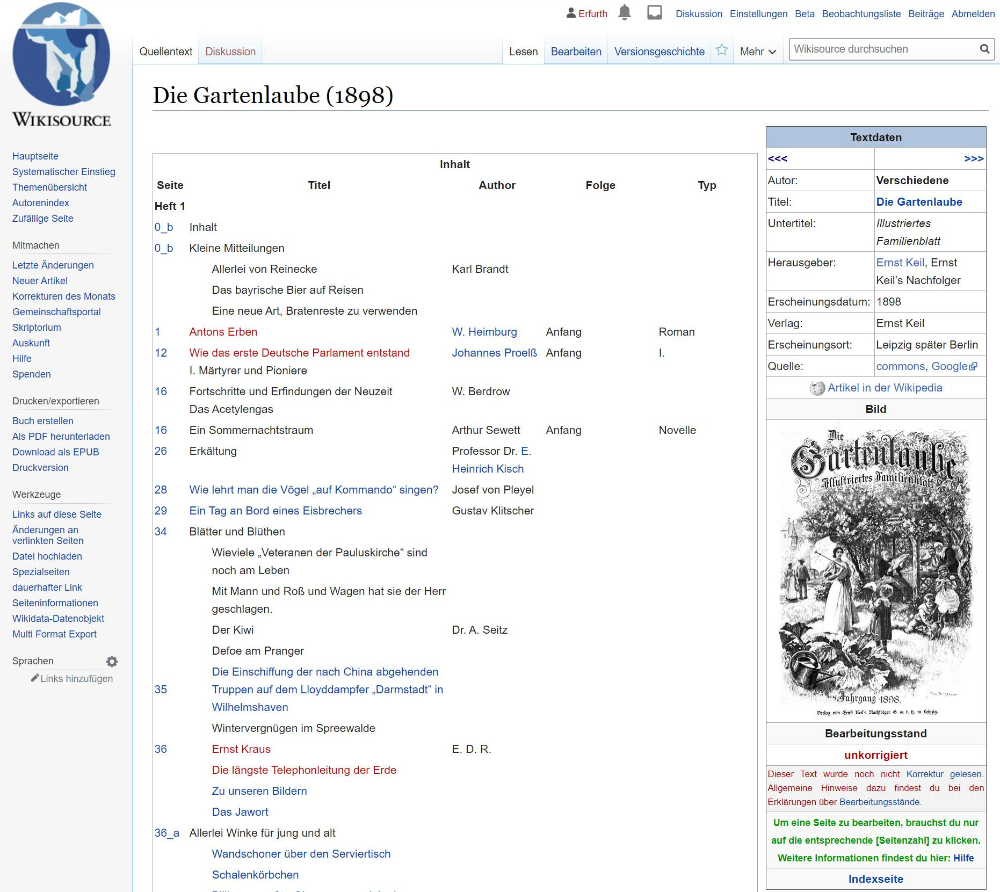
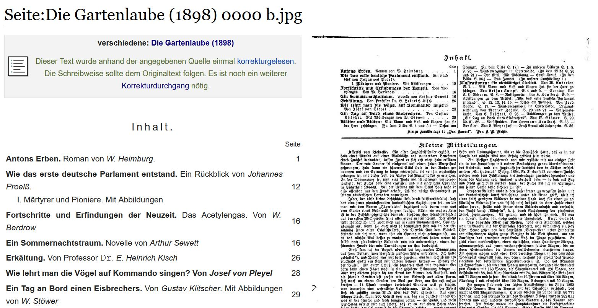
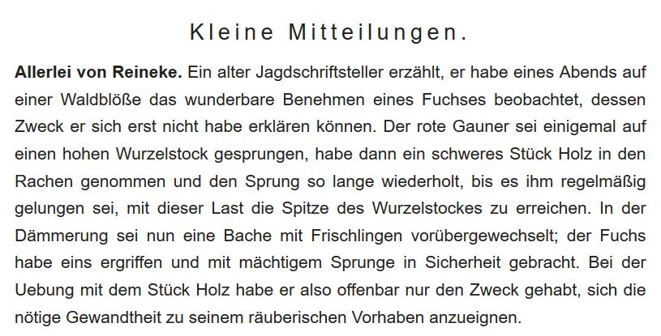
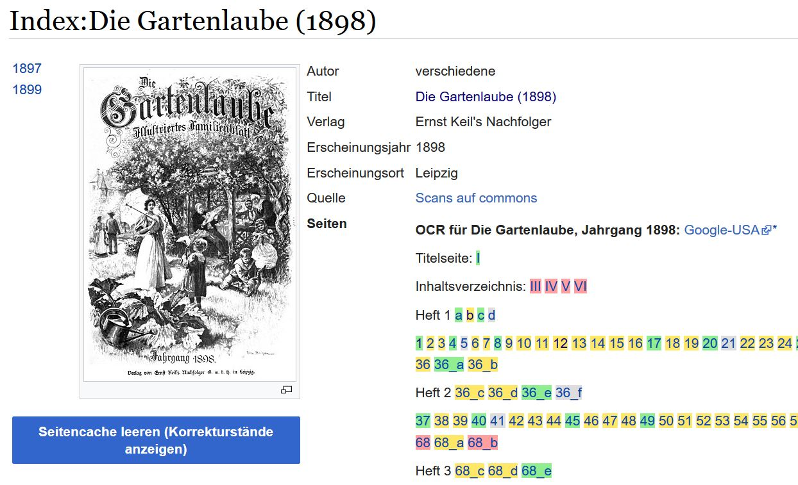
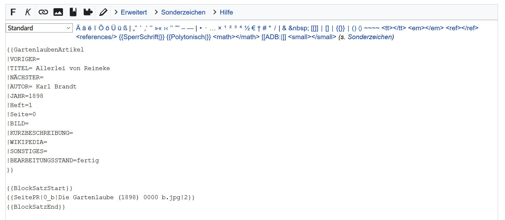
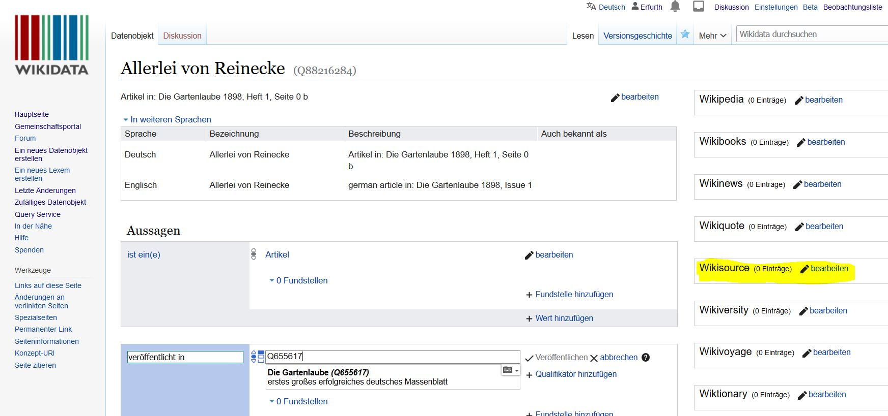
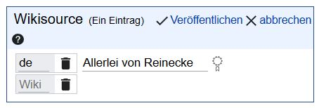

# Gartenlauben-Artikel auf Wikisource nach Wikidata

## Die Gartenlaube 1898 auf Wikisource

Unter dem [Link](https://de.wikisource.org/wiki/Die_Gartenlaube_(1898)) (de.wikisource.org/wiki/Die_Gartenlaube_(1898) findet man die Jahresausgabe der Zeitschrift "Die Gartenlaube" aus dem Jahr 1898. Es fallen zuerst die roten Links auf, aber auch schwarzer Text und blaue Seitenzahlen - alles in allem noch eine unvollständige Ausgabe. Wir nehmen uns also eine der _"Kleinen Mitteilungen"_ mit	*Allerlei von Reinecke* von Karl Brandt vor.



## Artikel korrekturlesen, neuen Wikisource-Artikel anlegen bzw. verlinken

Folgt man dem [Link](https://de.wikisource.org/wiki/Seite:Die_Gartenlaube_(1898)_0000_b.jpg) auf Seite 0_b kommen wir zu den korrigierbaren Einzelseiten eines Wikisource-Werkes. Da noch ein weiterer Korrekturdurchgang nötig ist, klicken wir in der Seitenmenüleiste oben auf (Lesen | **Bearbeiten** | Versionsgeschichte).




Nach der Korrektur von Fehlern kann unten der Seitenstatus auf /* Fertig */ (grüne Checkbox) geändert werden. Zu Beachten ist hier die korrekte Verwendung von Abschnittsmarkern ```<section begin=2 />``` und ```<section end=2 />``` für unseren späteren Artikel *Allerlei von Reinecke*.

Mit dem Klick auf das Pfeilsymbol "/\" bzw. den Wikisource-Link mit einem [Link](https://de.wikisource.org/wiki/Index:Die_Gartenlaube_(1898)) "Index:Die_Gartenlaube_(1898)" sind weitere zu korrigierende Seiten in gelb (wenig Änderungen) bzw. rot (viele Änderungen) aufgelistet und diese werden uns später in den Sog des Editieren ziehen :)



In der [Inhaltsübersicht](https://de.wikisource.org/wiki/Die_Gartenlaube_(1898)) zur **Gartenlaube 1898** können wir nun der schwarzen Text "Allerlei von Reinecke" in einen roten Link verwandeln, in dem wir den Seitenquelltext bearbeiten und um die Zeichenkette "[[Allerlei von Reinecke]]" zweimal eckige Klammern setzen. Durch Klick auf den roten Link dann, wird letztlich ein neuer Artikel angelegt (_TODO_: Suche vorher, ob es schon einen solchen Artikel gibt). Im Quelltext werden dabei zwei Arten von Wikitemplates verwendet: 1) {{GartenlaubenArtikel ... }} dieses Template beschreibt die Navigation der Seite und 2) zwischen {{BlockSatzStart}} und {{BlockSatzEnd}} stehen Templates für das Einbinden der korrekturgelesenen Seiten (mit ihren jeweiligen Sections): in unserem Fall nur {{SeitePR|0_b|Die Gartenlaube (1898) 0000 b.jpg|2}}



Unter 1) sollten auch noch etwa vorhandene [Autoren](https://de.wikisource.org/wiki/Die_Gartenlaube/Autoren) und vorhergehende bzw. nachfolgende Artikel in eckigen Klammern, während der Bearbeitungsstand nur mit korrigiert/fertig angegeben wird.
...


## Wikidata-Artikel prüfen und anlegen

Nachdem wir nun einen Artikel https://de.wikisource.org/wiki/Allerlei_von_Reinecke angelegt haben, wird es Zeit, diesen auch in Wikidata anzulegen, um ihn am Ende mit weiteren Metadaten anreichern können. Dazu klicken wir auf "[Create a new item](https://www.wikidata.org/wiki/Special:NewItem)"


Ein Wikidata-Artikel zeichnet sich durch eine Anzahl von Aussagen (statements) über verschiedene Eigenschaften (properties) und Vermerke (qualifiers) dazu aus. Im Fall von Artikeln zu "Die Datenlaube" sind dies vorallem die folgenden: der Artikel wurde publiziert in Die Gartenlaube (Item Q655617), Autor (soweit zuordenbar) und Veröffentlichungsdatum (Property:P577).



Über die Linking-Box "Wikisource" lässt sich zu guter Letzt der in Wikisource angelegte Artikel verlinken. Ein zentrales Thema (Property P:921 sollte zu den Metadaten eines Wikidata-Artikels ebenfalls vergeben werden, um spätere Auswertungen zu ermöglichen.


<p>&nbsp;</p>
<p>Matthias Erfurth, 9. Februar 2021</p>
&nbsp;&nbsp;&nbsp;<a rel="license" href="http://creativecommons.org/licenses/by/4.0/">Creative Commons Namensnennung 4.0 International Lizenz</a> <a rel="license" href="http://creativecommons.org/licenses/by/4.0/"><script src="https://hypothes.is/embed.js" async></script>
