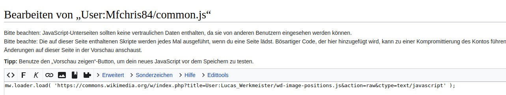
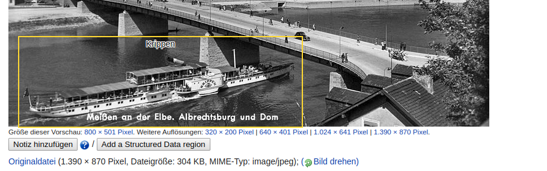

<h1 id="beschreiben-wir-bilder-punktgenau">Beschreiben wir Bilder punktgenau!</h1>

Die <a href="https://twitter.com/search?q=%23DieDatenlaube&amp;src=typed_query">#Datenlaube</a> hat den „<a href="https://w.wiki/Qcn">illustrativen</a>“ Aspekt der <a href="https://de.wikisource.org/wiki/Die_Gartenlaube">Gartenlaube</a> noch verstärkt zu bearbeiten. <a href="https://commons.wikimedia.org/wiki/Commons:Structured_data">Structured Data On Commons</a> ist bzw. wird dabei das Mittel der Wahl sein, um die unzähligen Illustrationen zu erschließen und mit den entsprechenden Artikeln zu verknüpfen.

Die inhaltliche Erschließung (Motiv) der Bilder ist dabei eine der spannendsten Aufgaben. Mit 'Structured Data On Commons' erfolgt eine verlinkte Sacherschließung mit Rückgriff auf die in Wikidata hinterlegten Konzepte. Dabei sind naturgemäß auf Bildern oftmals viele unterschiedliche Personen, Tiere oder Objekte abgebildet. Mit dem Tool <a href="https://wd-image-positions.toolforge.org/">WD-Image-Positions</a> können die einzelnen Motivteile mit einem viereckigen Rahmen auf dem Bild exakt näher beschrieben und voneinander abgegrenzt werden.

Um mit dem Tool direkt in <a href="https://commons.wikimedia.org/">Wikimedia Commons</a> arbeiten zu können, muss im eigenen Benutzernamensraum auf der Seite <a href="https://commons.wikimedia.org/wiki/User:BenutzerName/common.js">commons.js</a> das <a href="https://commons.wikimedia.org/w/index.php?title=User:Lucas_Werkmeister/wd-image-positions.js">wd-image-positions.js-Skript</a> eingebunden werden. Dazu bitte auf der eigenen commons.js Seite auf „Bearbeiten“ klicken und folgende Code-Zeile einfügen:

<pre>mw.loader.load( 'https://commons.wikimedia.org/w/index.php?title=User:Lucas_Werkmeister/wd-image-positions.js&amp;action=raw&amp;ctype=text/javascript' );</pre>

Mit dem eingebundenen Skript erhält man nun auf Dateiseiten in Commons zwei praktische Features:

<ul>
<li>Bereits mit Bildausschnitt beschriebene Motive werden mit der Bezeichnung des Motivs und dem Bereich gelbumrandet im Bild dargestellt.</li>
<li>Unterhalb des Bildes gibt es einen Button „Add a Structured Region“, der das File direkt im WD-Image-Positions Tool öffnet.</li>
</ul>

Folgende Schritte sind notwendig, um mit dem 'WD Image Positions-Tool' Bildausschnitte von Motiven näher zu definieren:

<ol style="list-style-type: decimal">
<li>Im Structured Data-Bereich auf Commons einzelne Motive benennen und mit Wikidata verlinken.</li>
<li>Klick auf „Add a Structured Data region“!</li>
<li>Im 'WD Image Positions-Tool' unterhalb des Bildes bei den vorhandenen Motiv-Items auf „add region“ klicken. Darauf achten, dass das Tool für den eigenen Wikimedia-Account authentifiziert ist: bitte einloggen! </li>
<li>Das Rechteck im Bild auf den relevanten Bildausschnitt zurechtziehen</li>
<li>Beim Item unterhalb des Bildes auf „use region“ klicken.</li>
</ol>

 <video width="640" height="480" controls>
  <source src="Pictures/wdimg_addSDC.mp4" type="video/mp4">
  <source src="Pictures/wdimg_addSDC.webm" type="video/webm">
Your browser does not support the video tag.
</video> 

&nbsp;

Christian Erlinger, 12. Mai 2020

&nbsp;&nbsp;&nbsp;<a rel="license" href="http://creativecommons.org/licenses/by/4.0/">Creative Commons Namensnennung 4.0 International Lizenz</a> <a rel="license" href="http://creativecommons.org/licenses/by/4.0/">
  
