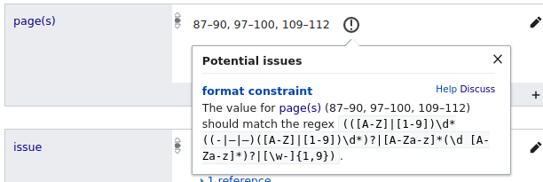
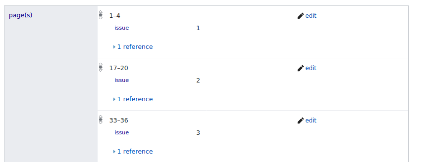

<h1 id="in-fortsetzung-folgt.---metadaten-für-artikel-der-gartenlaube-mit-geteilter-erscheinungsweise">„...in Fortsetzung folgt.“ - Metadaten für Artikel der Gartenlaube mit geteilter Erscheinungsweise</h1>

Die Vielfalt der in der <a href="https://de.wikipedia.org/wiki/Die_Gartenlaube">Gartenlaube</a> veröffentlichten <a href="https://de.wikisource.org/wiki/Die_Gartenlaube">Artikel</a> spiegelt sich auch in ihrer Form wieder. Kurze Miniaturen und Mitteilungen stehen neben Erzählungen und dem großen Roman. Da ein Heft aus nur relativ wenigen Seiten bestand (im Publikationsjahr 1853 in etwa ein Dutzend Blatt) und mehrere Artikel pro Ausgabe Platz finden sollten, ist es natürlich naheliegend, weshalb Artikel in Fortsetzung erschienen sind. (Abgesehen von formalen oder produktionstechnischen Überlegungen war es vielleicht auch einfach ein geschickter Einsatz um die Leserschaft bei der Stange zu halten)

Im Projekt zur Erschließung der Gartenlaube in Wikisource werden die geteilten Artikel sinnvollerweise als eine Leseeinheit zusammengefasst. In der bibliographischen Infobox wird die geteilte Erscheinungsweise durch Angabe der Heftnummern und Seitenzahlen mit Komma, Semikolon oder Bindestrichen entsprechend ausgewiesen.

Bei der Übernahme der Metadaten in die Wikidata-Items wurden die vorliegenden Strings für Seitenzahl und Heft im vorliegenden Format übernommen. Abgesehen davon, dass die Angabe von Seitenzahlen mit Komma oder Semikolon als ungültiges Seitenzahlenformat in Wikidata eine Fehlermeldung hervorruft, verhindert eine derartige einfache Notation das volle Potential bibliographischer Erschließung und Abfragbarkeit in Wikidata auzuschöpfen.

 
Abb. 2: Format Constraint bei Seitenzahlen mit Komma oder Semikolon (vgl. https://www.wikidata.org/wiki/Q19165369#P304)

Bei einer Angabe eines Bereiches von Heftnummern wie 1–5 ist für eine maschinenbasierte Auswertung ohne weitere Verarbeitung nicht erkennbar, dass der Artikel in den Heften mit den Nr 1, 2, 3, 4 und 5 erschienen ist. Bei gleichzeitigem Vorliegen der Seitenzahlenbereiche S. 1–4, 17–20, 33–36, 49–52, 66–69 ist es noch weniger eindeutig für eine maschinelle Auswertung erkennbar, dass beispielsweise der Seitenzahlbereich 33–36 zum Heft Nr. 3 zugehörig ist. 

Die Katalogisierung in Wikidata erlaubt sowohl bei der Notation der Heftnummern wie der Seitenzahlen die entsprechenden einzelnen Werte mit „Qualifier“ zu kontextualisieren: 

 
Abb. 3: Seitenzahlenangaben in Wikidata (vgl. https://www.wikidata.org/wiki/Q19180471#P304)

Diese Angabe erlaubt nun die maschinelle Erstellung von exakten Inhaltsverzeichnissen für jedes Heft, da nun jede Heftnummer und Seitenzahl abfragbar wird. Ebenso ist die exakte Recherche nach einem spezifischen Artikel über die Heftnummer und Seitenzahl möglich, was ebenfalls bei der ursprünglichen Angabe nicht ohne weiteres möglich wäre.

<pre>
SELECT *  WHERE {
  ?artikel p:P1433 ?pubStmt.
  ?pubStmt ps:P1433 wd:Q655617;
           pq:P304 ?seiten;
           pq:P433 ?issue;
           pq:P577 ?pubdate.
  BIND (year(?pubdate) as ?pubyear) 
  FILTER(?pubyear = 1863)
  Filter(?issue = "3")
}
</pre><a href="https://w.wiki/HU4">Try it!</a>

Hingegen ist das Auslesen von einfachen, „einzeiligen“ und für den Menschen leichter lesbaren Quellenangaben natürlich weiterhin möglich allerdings mit einem etwas gesteigerten Aufwand verbunden.

<pre>
SELECT ?Gartenlaube (GROUP_CONCAT(?seiten;separator="; ") AS ?pages) ?issue ?pubyear WHERE {
  wd:Q19180471 p:P1433 ?pubStmt.
  ?pubStmt ps:P1433 ?Gartenlaube;
           pq:P304 ?seiten;
           pq:P433 ?issue;
           pq:P577 ?pubdate.
  BIND (year(?pubdate) as ?pubyear) 
}
GROUP BY ?Gartenlaube ?issue  ?pubyear
</pre><a href="https://w.wiki/HU5">Try it!</a>

Die hier vorgeschlagene Vorgangsweise für eine strukturierte Erfassung von Seitenzahlen und Heftnummerierung bei geteilt erschienen Zeitschriftenartikeln ermöglicht gewisse Vorteile in der maschinellen Abfragbarkeit und Recherche. Womöglich widerspricht dies aber eine orthodoxen Anwendung bibliographischer Regelwerke, die in derartigen Fällen Aufnahmen für jeden Teil unter Verlinkung auf eine fiktive (respektive in Wikisource auch faktisch dargestellte) Einheit des Artikels vorsehen könnte. Zugegeben könnte man der hier gezeigten Variante nachteilig zuschreiben, dass (noch) nicht klar ist, dass die angegeben Seitenzahlen Teile des ganzen Artikels repräsentieren und nicht wiederholte Erscheinungen des Gesamten. Dies könnte allerdings ebenfalls durch einen spezifischen Qualifier im Seitenzahlen- bzw. Heft-Statement entsprechend ausgezeichnet werden. Man sieht auch in diesem Fall zu Fragen der formalen Erschließung in Wikidata gilt wohl „… Fortsetzung folgt.“

<em>Christian Erlinger (</em><a href="https://www.wikidata.org/wiki/Q67173261"><em>Q67173261</em></a><em>)</em>

Veröffentlicht: 02-2020, 

&nbsp;&nbsp;&nbsp;<a rel="license" href="http://creativecommons.org/licenses/by/4.0/">Creative Commons Namensnennung 4.0 International Lizenz</a> <a rel="license" href="http://creativecommons.org/licenses/by/4.0/">

